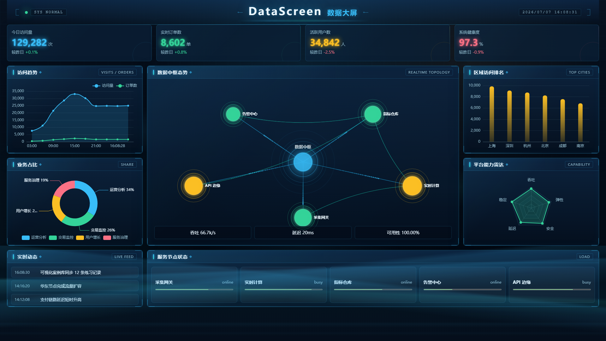

# DataScreen 数据大屏

基于 Vue 3 + TypeScript + ECharts + Express + MySQL 构建的数据可视化大屏项目。采用深色科技风 + 国风元素融合设计，展示数据中心 20 台服务器的真实运行监控数据。

## 项目预览



## 项目简介

DataScreen 是一个全栈数据可视化大屏项目，用于展示数据中心服务器的运行监控状态。项目使用 D3 大数据专题作业处理后的真实监控数据（20 台主机 × 55 项指标 × 24 小时），经过 MySQL 数据库存储后，通过 Express 后端接口提供给前端大屏展示。

大屏包含：
- 在线主机数、平均 CPU、平均内存、告警主机数等核心指标
- CPU 趋势折线图
- 指标类型占比饼图
- 主机拓扑态势图
- CPU 使用排名
- 集群能力雷达
- 告警动态
- 主机节点状态

## 核心特性

- **真实数据驱动** — 从 D3 作业的 CSV 处理结果导入 MySQL，前端通过 API 展示真实监控数据
- **1920x1080 大屏布局** — CSS Grid 3 列 4 行自适应布局，小屏自动降级
- **5 种 ECharts 图表** — 折线趋势图、横向柱状排名图、环形饼图、雷达图、关系拓扑图
- **Mock / API 双模式** — 环境变量一键切换，无 MySQL 时也能用模拟数据运行
- **深色科技风 + 国风元素** — 暗蓝背景、青蓝/玉青/鎏金配色、淡山峦剪影、云纹雾气、四角卷轴装饰
- **全栈架构** — Vue 3 前端 + Express 后端 + MySQL 数据库
- **TypeScript 全覆盖** — 前后端类型定义完整
- **自动化截图** — 一键生成项目展示截图

## 技术栈

| 分类 | 技术 | 说明 |
|------|------|------|
| 前端框架 | Vue 3 (Composition API) | `<script setup lang="ts">` |
| 构建工具 | Vite | 开发与生产构建 |
| 语言 | TypeScript | Strict 模式 |
| 可视化 | ECharts 6 | 所有图表 |
| 状态管理 | Pinia | Store + Actions |
| 后端框架 | Express 5 | API 服务 |
| 数据库 | MySQL 8 | 数据存储 |
| 数据库驱动 | mysql2 | Node.js Promise 驱动 |
| 数据导入 | Python + pymysql | CSV → MySQL |
| HTTP 客户端 | Axios | 前端请求后端 API |
| E2E 测试 | Playwright | Chromium |
| 代码规范 | ESLint + Prettier + Stylelint | 统一规范 |

## 项目结构

```text
src/
  app/              应用入口
  charts/           ECharts 图表组件
  components/       大屏业务组件
  config/           主题配置
  layouts/          大屏外层容器
  mocks/            Mock 数据 + 实时模拟器
  server/           Express 后端 API
  services/         数据访问层（Mock/API 判断 + HTTP Client）
  stores/           Pinia 状态
  types/            TypeScript 接口
  utils/            工具函数
  views/            页面视图
scripts/            辅助脚本（截图、数据导入）
server/             Express 后端入口
```

## 环境要求

- Node.js >= 18
- npm >= 9
- MySQL >= 8.0（或 Docker 运行的 MySQL）
- Python >= 3.8（用于导入 CSV 到 MySQL）

## 快速开始

### 1. 安装依赖

```bash
npm install
```

同时安装 Python 依赖：

```bash
pip install -r scripts/requirements.txt
```

### 2. 配置 MySQL 连接

项目已提供 `.env` 文件，默认连接信息为：

```text
DB_HOST=127.0.0.1
DB_PORT=3306
DB_USER=root
DB_PASSWORD=root
DB_NAME=datascreen
```

如果你的 MySQL 配置不同，修改 `.env` 文件即可。

### 3. 导入数据到 MySQL

数据来自 `homeworks/D3/3_hourly/` 目录下的处理结果：

```bash
npm run load-data
```

或直接运行 Python 脚本：

```bash
python scripts/load_data_to_mysql.py
```

这会创建 `datascreen` 数据库和 `hourly_summary`、`daily_summary` 两张表，并导入 CSV 数据。

### 4. 启动项目

```bash
npm run start
```

该命令会同时启动后端 API（端口 3000）和前端开发服务（端口 10001）。

也可以分别启动：

```bash
# 终端 1：启动后端
npm run server

# 终端 2：启动前端
npm run dev
```

### 5. 访问大屏

浏览器打开：

```text
http://127.0.0.1:10001
```

默认使用真实数据（`VITE_DATA_SOURCE=api`）。如果 MySQL 未启动，可以把 `.env` 中的 `VITE_DATA_SOURCE` 改为 `mock`，使用模拟数据运行。

## 常用命令

| 命令 | 说明 |
|------|------|
| `npm run dev` | 启动前端开发服务器 |
| `npm run server` | 启动 Express 后端 API |
| `npm run start` | 同时启动后端 + 前端 |
| `npm run load-data` | 把 CSV 数据导入 MySQL |
| `npm run build` | 类型检查 + 生产构建 |
| `npm run preview` | 预览构建产物 |
| `npm run lint` | ESLint + Stylelint 检查 |
| `npm run format` | Prettier 格式化 |
| `npm test` | 运行单元测试 |
| `npm run test:e2e` | 运行 E2E 测试 |
| `npm run screenshot` | 生成大屏截图 |

## 数据源说明

项目支持两种数据源模式，通过 `.env` 中的 `VITE_DATA_SOURCE` 控制：

### API 模式（默认，真实数据）

```bash
VITE_DATA_SOURCE=api
```

前端通过 `/api/dashboard` 请求 Express 后端，后端从 MySQL 查询 D3 真实监控数据。

### Mock 模式（模拟数据）

```bash
VITE_DATA_SOURCE=mock
```

无需 MySQL，使用 `src/mocks/realtimeDashboardSimulator.ts` 生成模拟的服务器监控数据，每 2 秒自动刷新。

## 后端 API

| 接口 | 说明 |
|------|------|
| `GET /api/dashboard` | 聚合大屏数据：指标卡、主机列表、CPU 趋势、排名、分类占比 |
| `GET /api/trends?metric=cpu_usage` | 指定指标的 24 小时趋势 |
| `GET /api/hosts/:hostid` | 单台主机的详细指标 |

## License

MIT

---

> DataScreen — 数据中心运行监控大屏
